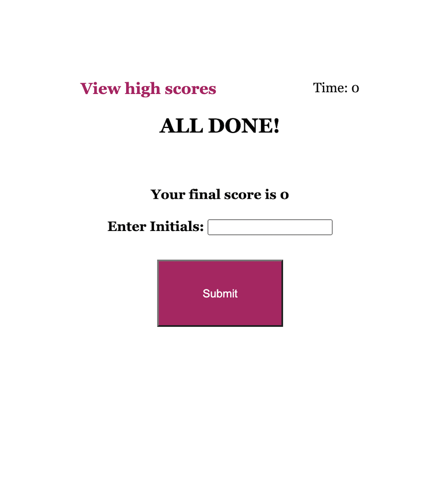
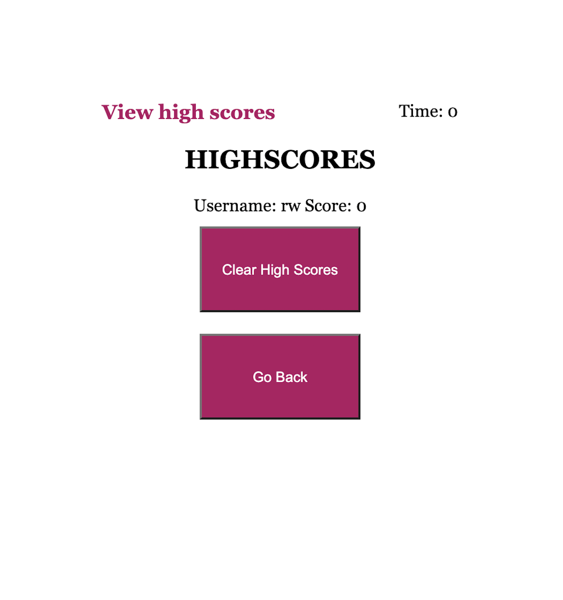
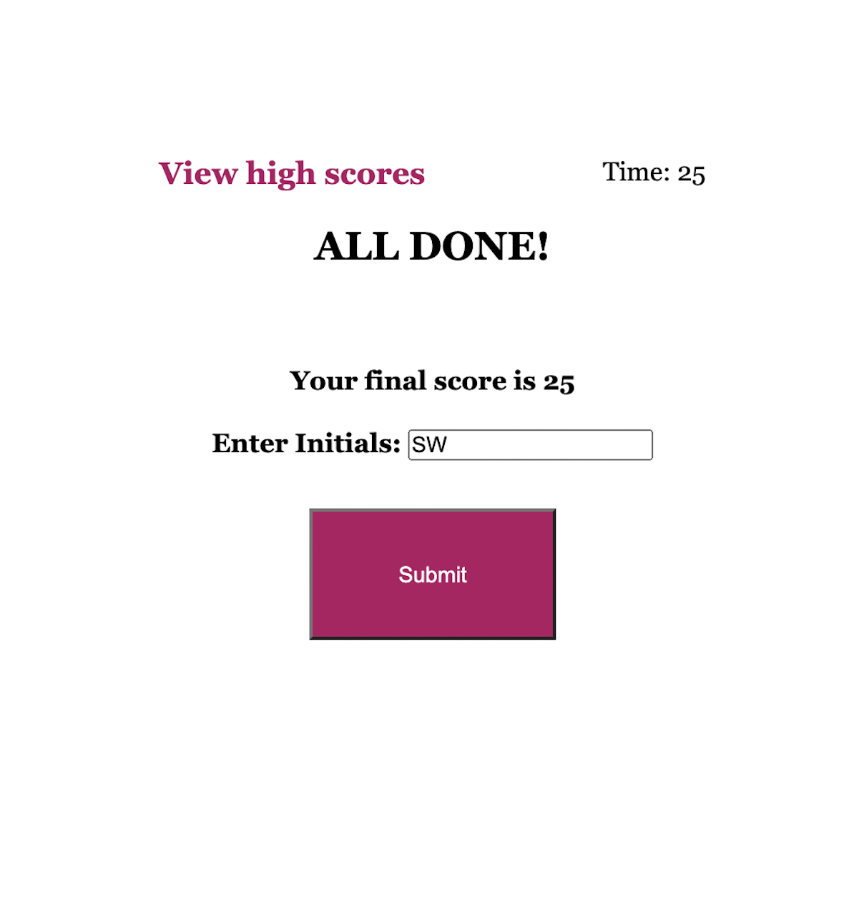

# are-you-a-whiz-code-quiz-ohya

Link to deployment: https://sabrtraveler.github.io/are-you-a-whiz-code-quiz-ohya/ 

This challenge of the bootcamp was to create a quiz that allows a user to store their high score in the local host.  
Thee quiz checks has the following features: 

<li>If the user selects the wrong quiz answer there is a message that shows "Correct!" or "Wrong!". 
<li>As soon as the quiz starts - the timer starts at 75 seconds and goes down by every 1 second. 
<li>For every inccorect answer, the timer goes down by 10 seconds. 
<li>At the end of the quiz or when the timer reaches 0 - the time left that equals the users final score.  
<li>At the end of the quiz the user is able to type their initials and save their highscore.  
The following images shows the web application's appearance and functionality:   
  
  
  
  
  
  
